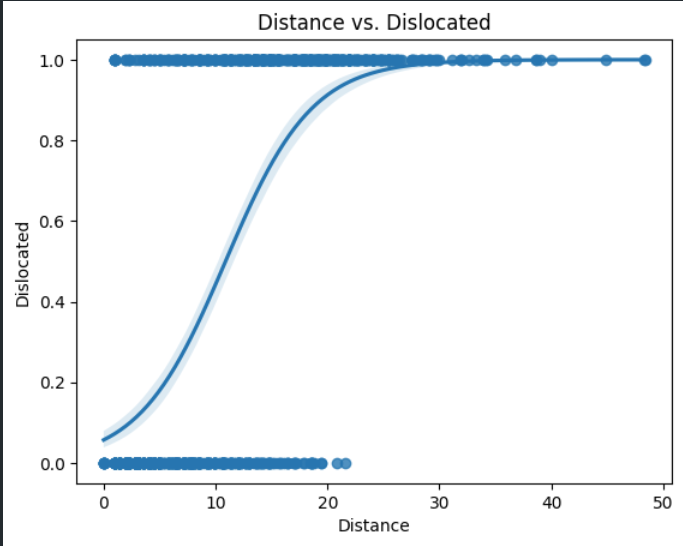
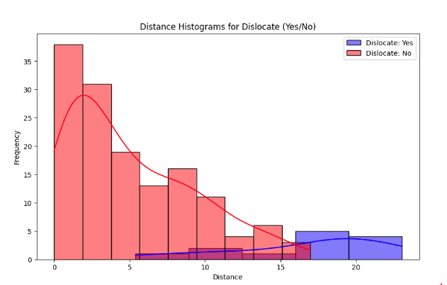

# TMJ Disk Dislocation Classification
This repository contains the code to replicate the paper entitled "Automated Pediatric TMJ articular disk identification and displacement classification in MRI with machine learning"

The segmentation model is from [https://github.com/MenxLi/UNets-TMJ/tree/main](https://github.com/MenxLi/UNets-TMJ/tree/main).

# Prerequisite
**Working directory should be where this file exists.**

## Package installation
All packages under `./packages` should be installed, then install the packages specified in `./requirements.txt`:
```bash
pip install ./packages/*
pip install -r requirements.txt
```
In addition, PyTorch enviroment should be setup.

## Raw format
The data in our experiment were labeled with our in-house developed software named `labelSys`. The data was saved in json format with images encoded as base-64 string. 
Two examples of the data can be found in `./data-demo` and the tool to extract the label was provided in `./packages/labelSys`   

***(Simply using demo-data is insufficient to train the model in 5-fold scheme. For code-testing propose you need to manually duplicate the demo data)***

## Setup enviroment variables
The configuration of the dataset path should be setup in `./setUpEnv.sh` and run:
```bash
source ./setUpEnv.sh
```

# Model training
## UNet++ model
### Data Preparation
<!--Make it clearer later-->
<!-- The data directory should be structured as follows:

```
Data folder
├── Label folder 1
│   ├── HEAD_0.json
│   ├── Slice_1.json
│   ├── ...
├── Label folder 2
│   ├── HEAD_0.json
│   ├── Slice_1.json
│   ├── ...
``` --> 


The original data format shown in `./data-demo` is compressed and encoded.
Data format conversion could be performed to generate data in numpy format and saved in pickle file (`UNetPPTMJ/.TempDir/data-*.pkl`) using:
```bash
python -m UNetPPTMJ.dataloading.rawDataPreparation
```
One can write their own script that generate data in compliance with the generated pickle file.  

### Train
To train the UNet++ model, run:
```bash
python -m UNetPPTMJ.train --fold <fold>
```
(To configure the training settings, modify `UNetPPTMJ.trainer.trainerTMJ.TrainerTMJ`)

The model will be saved under `UNetPPTMJ/.TempDir/`  
In our experiment, the training of 5 folds with images from 100 volumes in a single 3090 GPU took around 3 days.

## nnUNet model
### Data Preparation
Prior to training, dataset format has to be converted to that requested by nnUNet:
```bash
python -m nnUNetTMJ.datasetConversion.prepareDatasets_TMJ
```
The task name assigned to this dataset is: "Task501_TMJSeg"

### Train
Then, following the nnUNet official instructions (see [here](./packages/nnUNet/readme.md)) we plan and train the nnUNet model:

```bash
nnUNet_plan_and_preprocess -t 501 --verify_dataset_integrity
nnUNet_train 3d_fullres nnUNetTrainerV2 Task501_TMJSeg <fold> --npz
```
In our experiment, the training of 5 folds with 100 volumes in a single 3090 GPU takes around 1 week.

# Model evaluation
## Inference on test dataset
To facilitate model evaluation, the models predict test set and produce results saved in npz file for further analysis.  
Following are the instructions to generate the evaluation data:
### UNet++

Predict from a label directory
```bash
python predict.py -f $(for i in {0..4}; do echo "<MODEL_PATH>/model_f-$i"; done) -d <LABELED DIRECTORIES> -o <OUTFILE>
```

or recursively predict from a directory

```bash
python predict_recursive.py -f $(for i in {0..4}; do echo "<MODEL_PATH>/model_f-$i"; done) -d <DIRECTORY> -o <OUTFILE>
```


```bash
python -m UNetPPTMJ.generateResults -f $(for i in {0..4}; do echo "./UNetPPTMJ/.TempDir/model_f-$i"; done)
```
The generated result is ensembled from the 5-folds models. The resultant file, by default, is `./UNetPPTMJ/.TempDir/result-upp.npz`


To run mask_calculations, the predictions must be saved in the form of LabelSys. The mask predictions from above should be converted into contours of Disc, Condyle, and Eminence.


### nnUNet
We first generate 5 different results from 5 models using: 
```bash
python -m nnUNetTMJ.cmds.generateNibResults
```
Then we are going to ensemble them with:
```bash
nnUNet_ensemble -f $(for i in {0..4}; do echo "$infer_output/f$i"; done) -o nnUNetTMJ/.TempDir/Ensemble_unet_3dfullres_1000epochs
```
Finally, convert the data to numpy array and save in npz format:
```bash
python -m nnUNetTMJ.cmds.evalDataGen
```
The ensembled resultant by default is `./nnUNetTMJ/.TempDir/result-nnunet.npz`

## Evaluate
The npz file (generated in previous process) to be evaluated has the following data structure:
```python
Data(TypedDict):
    imgs    # MRI images
    masks   # predicted masks
    labels  # ground truth labels
```
Run:
```bash
evalResult <file_name>.npz
```
On evaluation, the result will be printed and saved to `./eval_log.txt`. Intermidiate metrics will be saved into `./evaluation/.TempDir` in pkl format for further statistical analysis (performed with [SPSS](https://www.ibm.com/analytics/spss-statistics-software) and others).

## Disk Dislocation Classification

The script located at [inference/tmj_mask_calculations_from_pred.py](inference/tmj_mask_calculations_from_pred.py) computes the distance between the centers of the eminence line and the disk. The results are saved in an .xlsx file for further analysis.

Additionally, [inference/TMJ_AUC_Calculations.ipynb](inference/TMJ_AUC_Calculations.ipynb) is utilized to plot the Area Under the Curve (AUC) for the distances between dislocated and non-dislocated disks. This AUC helps identify the optimal threshold for classifying dislocations based on distance.

A logistic regression curve fitted on the distance versus dislocation data suggests that dislocated disks are generally associated with greater distances, whereas non-dislocated disks are typically found at shorter distances. Specifically, a distance greater than 10 corresponds to dislocated disks (p=0.5), while distances less than 10 indicate normal disks (see the figure below).


In our experiment, a threshold of **9.3** resulted in the following metrics for classifying dislocations:

- AUROC: 95%
- AUPR: 81.0%
- FPR95: 20%

